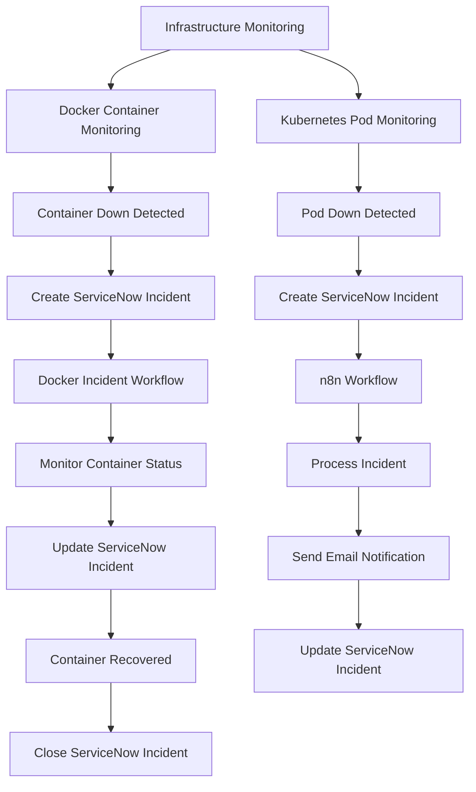
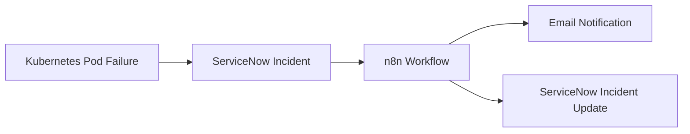

# 💡 Solution

This project provides an automated incident management platform for **Docker containers and Kubernetes pods**.

The platform monitors infrastructure components, detects failures, creates ServiceNow incidents, processes incident updates, and automates notifications.

The project contains two major automation workflows:

### 1. Docker Container Incident Automation

When a Docker container goes down, the monitoring workflow detects the failure and automatically creates a ServiceNow incident.

The incident is then updated based on the container status and closed when the container is recovered.

### 2. Kubernetes Pod Incident Automation

When a Kubernetes pod goes down, the automation detects the failure and creates a ServiceNow incident.

The workflow uses **n8n** to orchestrate notifications and sends the incident information through email. The corresponding ServiceNow incident is also updated automatically.

---

# 🏗️ Architecture



---

# 🔄 Automation Workflows

## 🐳 Part 1 — Docker Container Incident Automation

The Docker automation workflow continuously checks container health and detects when a monitored container is no longer running.

### Workflow

```text
Docker Container
       ↓
Container Monitoring
       ↓
Container Down
       ↓
Create ServiceNow Incident
       ↓
Troubleshooting / Monitoring
       ↓
Container Status Check
       ↓
Update ServiceNow Incident
       ↓
Container Recovered
       ↓
Close ServiceNow Incident
```

### Incident Lifecycle

```text
Container Down
      ↓
Incident Created
      ↓
Incident Updated
      ↓
Container Recovered
      ↓
Incident Closed
```

This creates an automated incident lifecycle instead of requiring an engineer to manually create, update, and close the incident.

---

## ☸️ Part 2 — Kubernetes Pod Incident Automation

The Kubernetes automation workflow monitors pod status and detects when a pod is down or unavailable.

### Workflow

```text
Kubernetes Pod
       ↓
Pod Monitoring
       ↓
Pod Down / Failure Detected
       ↓
Create ServiceNow Incident
       ↓
n8n Workflow
       ↓
Process Incident Information
       ↓
Send Email Notification
       ↓
Update ServiceNow Incident
```

n8n acts as the workflow orchestration layer for the Kubernetes incident workflow.

---

# 📧 Kubernetes Notification Workflow

The Kubernetes incident information is passed through the n8n workflow.



Example notification:

```text
Subject:
Kubernetes Pod Incident - INC0012345

Incident:
INC0012345

Component:
Kubernetes Pod

Status:
Down

Action:
Incident created and automation workflow triggered.
```

---

# 🔗 ServiceNow Integration

ServiceNow acts as the central incident management system for both automation workflows.

### Docker

```text
Docker Failure
      ↓
ServiceNow Incident
      ↓
Update
      ↓
Recovery
      ↓
Close
```

### Kubernetes

```text
Kubernetes Failure
      ↓
ServiceNow Incident
      ↓
n8n
      ↓
Email Notification
      ↓
ServiceNow Update
```

This allows infrastructure failures to be automatically connected with the incident management lifecycle.

---

# 🧩 Technology Stack

| Technology | Purpose |
|------------|---------|
| Python | Monitoring and automation logic |
| Docker | Container monitoring and incident detection |
| Kubernetes | Pod monitoring and failure detection |
| ServiceNow | Incident creation, update, and management |
| n8n | Workflow orchestration and notifications |
| REST APIs | System-to-system integration |
| Gmail / Email | Incident notifications |
| Ansible / AWX | Infrastructure automation where applicable |
| GitHub Actions | CI/CD |
| Git | Version control |

> Keep only the technologies that are actually used by the current implementation.

---

# ⚙️ Key Features

### 🐳 Docker Incident Automation

- Detects Docker container failures
- Automatically creates ServiceNow incidents
- Tracks container status
- Updates incidents based on execution results
- Closes incidents after successful recovery

### ☸️ Kubernetes Incident Automation

- Detects Kubernetes pod failures
- Automatically creates ServiceNow incidents
- Integrates with n8n
- Sends incident notifications through email
- Updates ServiceNow incidents automatically

### 🔗 ServiceNow Integration

- Automated incident creation
- Automated incident updates
- Automated incident closure for supported workflows
- REST API integration

### 🔄 Workflow Automation

- Event-driven incident processing
- Automated notifications
- Reduced manual intervention
- Centralized incident lifecycle management


